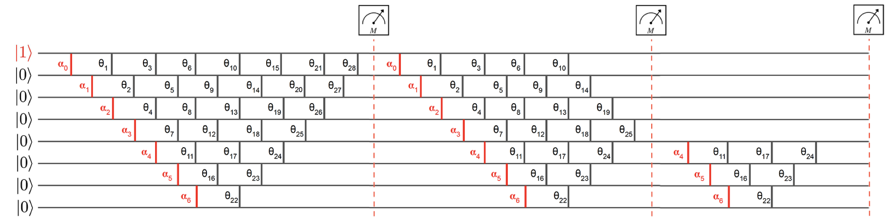

<h1 align="center" style="margin-top: 0px;"> <b>Classical and Quantum Algorithms for Orthogonal Neural Networks</b></h1>
<div align="center" >

[](https://arxiv.org/abs/2106.07198)
[](https://github.com/google/jax)
[](https://www.gnu.org/licenses/gpl-3.0.html)
[](https://colab.research.google.com/github/qdevpsi3/quantum-orthogonal-nn/blob/main/examples/mnist_classifier.ipynb)
</div>

<p align="center">

</p>

## **Description**

This repository contains an <ins>unofficial</ins> implementation of the <ins>Quantum-inspired Orthogonal Neural Network</ins> and its application to the  <ins>MNIST</ins> dataset classification problem as in :

- Paper : **Classical and Quantum Algorithms for Orthogonal Neural Networks**
- Authors : **Kerenidis, Landman and Mathur**
- Date : **2021**

## **Setup**

To <ins>install</ins>, clone this repository and execute the following commands :

```
$ cd quantum-orthogonal-nn
$ pip install -r requirements.txt
$ pip install -e .
```

or install directly with Git :
```
$ pip install git+https://github.com/qdevpsi3/quantum-orthogonal-nn.git
```


## **Documentation**

The package `orthax` contains an implementation of the <ins> Quantum-inspired Orthogonal Layer </ins> in both `stax` and `dm-haiku`. The available modules are :

- `orthax.stax.OrthogonalDense` (orthogonal version of `stax.Dense`)
- `orthax.haiku.OrthogonalLinear` (orthogonal version of `haiku.Linear`)
- `orthax.haiku.OrthogonalMLP` (orthogonal version of `haiku.nets.MLP`)


### orthax.stax.OrthogonalDense

| Parameters | Description | Default |
|:-:|:-:|:-:|
| `in_dim` | Input dimensionality. | - |
| `out_dim` | Output dimensionality. | - |
| `t_init` | Optional initializer for rotation angles. |Uniform initializer $[-\pi,+\pi]$|
| `b_init` | Optional initializer for bias. | Zero initiliazer|

```python
from jax.experimental import stax

import orthax

init_fun, apply_fun = stax.serial(
    orthax.stax.OrthogonalDense(8),
    stax.Sigmoid,
    orthax.stax.OrthogonalDense(4),
    stax.Sigmoid,
    orthax.stax.OrthogonalDense(4),
)
```

### orthax.haiku.OrthogonalLinear

| Parameters | Description | Default |
|:-:|:-:|:-:|
| `output_size` | Output dimensionality. | - |
| `normalize_inputs` | Whether or not to normalize layer inputs. | `False`|
| `with_bias` | Whether or not to apply a bias in each layer. | `True`|
| `t_init` | Optional initializer for rotation angles. |Uniform initializer $[-\pi,+\pi]$|
| `b_init` | Optional initializer for bias. | Zero initiliazer|

```python
import jax
import haiku as hk
import orthax

def forward(x):
    module = hk.Sequential([
        orthax.haiku.OrthogonalLinear(8),
        jax.nn.sigmoid,
        orthax.haiku.OrthogonalLinear(4),
        jax.nn.sigmoid,
        orthax.haiku.OrthogonalLinear(4),
    ])
    return module(x)

net = hk.transform(forward)
```

### orthax.haiku.OrthogonalMLP

| Parameters | Description | Default |
|:-:|:-:|:-:|
| `output_sizes` | Sequence of layer sizes. | - |
| `normalize_inputs` | Whether or not to normalize layer inputs. | `False`|
| `with_bias` | Whether or not to apply a bias in each layer. | `True`|
| `t_init` | Optional initializer for rotation angles. |Uniform initializer $[-\pi,+\pi]$|
| `b_init` | Optional initializer for bias. | Zero initiliazer|
| `activation` | Activation function to apply between layers. |`jax.nn.sigmoid`|
| `activate_final` | Whether or not to activate the final layer. |`False`|

```python
import jax
import haiku as hk
import orthax

def forward(x):
    module = orthax.haiku.OrthogonalMLP([8, 4, 4], activation=jax.nn.sigmoid)
    return module(x)

net = hk.transform(forward)
```

## **Experiments**
To run the experiments on the MNIST classification dataset, you can use the Jupyter notebook in the examples folder. You can also open in [Colab](https://colab.research.google.com/github/qdevpsi3/quantum-orthogonal-nn/blob/main/examples/mnist_classifier.ipynb).

By default, the hyperparameters are set to :

```python
# training parameters
seed = 123
batch_size = 50
n_components = 8
digits = [6,9]
learning_rate = 0.001
train_steps = 5000

# network parameters
output_sizes = [4,2]
normalize_inputs = False
with_bias = True
t_init = hk.initializers.RandomUniform(minval=-np.pi, maxval=np.pi)
b_init = hk.initializers.Constant(0.)
activation = jax.nn.sigmoid
activate_final = False
```